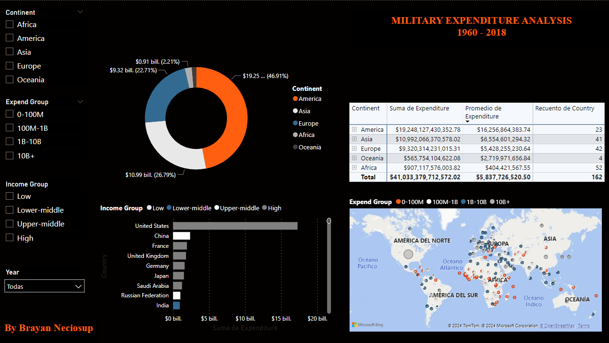

# 💣 Análisis de Gastos Militares: Tendencias y Potencias en Defensa 🌍

**Explora los gastos militares a nivel mundial y descubre qué países lideran el desarrollo económico en defensa y seguridad.**

Este proyecto utiliza **Power BI** para visualizar los **gastos militares** globales y las **tendencias** económicas en defensa. Mediante gráficos interactivos y un modelo de datos optimizado, los usuarios pueden examinar el desembolso económico en defensa de diversos países y entender su impacto en la seguridad global.

## 📌 Descripción

A través de este análisis interactivo, puedes visualizar cómo se distribuyen los **gastos militares** en todo el mundo. El reporte ofrece **tendencias clave** sobre el desembolso económico de países con mayor inversión en defensa. Además, permite identificar las economías más fuertes y cómo su gasto militar influye en su poder global.

### **¿Qué encontrarás en este análisis?**

✅ **Gastos por país**: Desglosado por las principales economías militares.  
✅ **Tendencias globales**: Cómo han evolucionado los gastos a lo largo de los años.  
✅ **Comparaciones estratégicas**: Relación entre los gastos y el poder militar de los países.  
✅ **Visualización interactiva**: Filtros dinámicos para explorar los datos a fondo.

## 🛠 Tecnologías Utilizadas

- **Power BI** → Para la creación de visualizaciones interactivas y análisis de datos.  
- **Excel** → Fuente de datos principal con la información de los gastos militares.  
- **Power Query** → Para la transformación y preparación de datos.  
- **DAX (Data Analysis Expressions)** → Cálculos avanzados para métricas clave.

## 🗂 Fuentes de Datos

Los datos provienen de varias fuentes de información pública sobre **gastos militares** a nivel mundial, y han sido procesados para proporcionar un análisis completo y detallado.

## 📸 Vista Previa

## 🛠 Cómo Usarlo

1. Descarga el archivo **.pbix** desde este repositorio.  
2. Abre el archivo en **Power BI Desktop**.  
3. Navega por las visualizaciones interactivas para obtener insights sobre los gastos militares.

## 🌍 Fuentes de Datos

Los datos son provenientes de fuentes confiables de informes anuales de gasto militar y bases de datos gubernamentales de defensa.

## ⭐ Contribuye o Apóyame

Si este proyecto te resultó interesante, no dudes en darle una **⭐ en GitHub** y compartirlo con tus colegas. También puedes contribuir mejorando el modelo o agregando nuevas funcionalidades.

📧 **Contáctame** en [bryanneciosup626@gmail.com] o [LinkedIn](https://www.linkedin.com/in/brayan-rafael-neciosup-bola%C3%B1os-407a59246/).

---

🔗 **Explora las tendencias de los gastos militares y descubre las potencias globales en defensa.** 🚀
